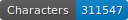
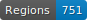
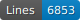

# HTR-SETAF-LesFaictzJCH

   

Ce dépôt est en cours de construction.

Ce dépôt contient les données OCR de différentes éditions des *Faits de Jésus Christ et du pape*. Il s'agit d'un ouvrage singulier de polémique religieuse, unique livre illustré de la Réforme francophone conservé pour la première moitié du XVIe siècle. Il a paru sous couvert d’anonymat, dans trois éditions successives, à Neuchâtel, Genève et Lyon, entre les années 1530 et 1560. 

La liste des textes avec plus de détails se trouve dans le tableau CSV du dépôt.


## Projet SETAF

GitHub du projet : https://github.com/SETAFDH 

Site du projet : https://www.unige.ch/setaf


## Financeur

Ce projet est financé par le Fonds national suisse (FNS). Numéro de projet : 205056 (https://data.snf.ch/grants/grant/205056).


## Données

Les données se trouvent au chemin ‘./data//.xml‘ et sont au format ALTO. Elles suivent les normes de segmentation SegmOnto (https://segmonto.github.io) et sont cataloguées sur HTR-United (https://htr-united.github.io). Les fichiers sont corrigés manuellement : la qualité de la segmentation des pages et de la transcription produite par l'OCR est indiqué dans le tableau CSV du dépôt ("gold" ou "en cours").

Le contrôle de la transcription produite par l'OCR se base sur un guide redigé par l'équipe du projet : Solfrini et al., _Guide de transcription pour les imprimés français du XVIe siècle en caractères gothiques_, Version A, 2023, https://hal.science/hal-04281804.


## Infrastructure

Les données pour l'OCR sont produites à l'aide de l’instance genevoise FoNDUE (https://www.unige.ch/lettres/humanites-numeriques/recherche/projets-de-la-chaire/fondue) d'eScriptorium (https://gitlab.com/scripta/escriptorium).

Les calculs sont effectués à l'Université de Genève en utilisant le service Baobab HPC : https://www.unige.ch/eresearch/fr/services/hpc/.


## Licence

Les transcriptions sont [CC-BY](https://creativecommons.org/licenses/by/4.0), et les images suivent les règles de différentes bibliothèques numériques :
- e-rara : https://www.e-rara.ch/wiki/termsOfUse?lang=en
- Österreichische Nationalbibliothek : https://www.onb.ac.at/en/use


## Citer le dépôt

à venir


## Citer le projet

Sonia Solfrini, Geneviève Gross, Brigitte Roux, Nathalie Szczech et Daniela Solfaroli Camillocci, _SETAF (S’en tenir aux 'Faits de Jésus Christ et du pape'). Les imprimés évangéliques romands et les pratiques de communication religieuse à l’époque de la Réforme_, Genève, université de Genève, 2023, https://www.unige.ch/setaf.

```bibtex
@misc{solfrini_SETAF_2023,
  author={Solfrini, Sonia and Gross, Geneviève and Roux, Brigitte and Szczech, Nathalie and Solfaroli Camillocci, Daniela},
  title={SETAF (S’en tenir aux 'Faits de Jésus Christ et du pape'). Les imprimés évangéliques romands et les pratiques de communication religieuse à l’époque de la Réforme},
  address={Genève},
  publisher={université de Genève},
  year={2023},
  url={https://www.unige.ch/setaf},
  note={numéro de projet FNS : 205056},
}
```
