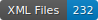

# HTR-SETAF-LesFaictzJCH

Ce dépôt contient les données HTR de différentes éditions des Faits de Jésus Christ et du pape. Il s'agit d'un ouvrage singulier de polémique religieuse, unique livre illustré de la Réforme francophone conservé pour la première moitié du XVIe siècle. Il a paru sous couvert d’anonymat, dans trois éditions successives, à Neuchâtel, Genève et Lyon, entre les années 1530 et 1560. La liste des exemplaires présents dans ce dépôt se trouve dans un tableau.csv.

   


## Projet SETAF

GitHub du projet : https://github.com/SETAFDH 
Site du projet : https://www.unige.ch/setaf


## Financeur

Ce projet est financé par le Fonds national suisse (FNS). Numéro de projet : 205056 (https://data.snf.ch/grants/grant/205056).


## Données HTR

Les données se trouvent au chemin ‘./data//.xml‘. Elles sont au format ALTO et suivent les normes de segmentation SegmOnto (https://segmonto.github.io). Toutes les données sont produites à l'aide de l’instance genevoise FoNDUE (https://www.unige.ch/lettres/humanites-numeriques/recherche/projets-de-la-chaire/fondue) d'eScriptorium (https://gitlab.com/scripta/escriptorium) et sont cataloguées sur HTR-United (https://htr-united.github.io). Les fichiers ALTO sont corrigés manuellement : le côntrole de la segmentation et de la transcription issue de l'HTR sont en cours.  


## Infrastructure

Les données pour l'HTR sont produites à l'aide de l’instance genevoise FoNDUE (https://www.unige.ch/lettres/humanites-numeriques/recherche/projets-de-la-chaire/fondue) d'eScriptorium (https://gitlab.com/scripta/escriptorium).


## Licence

Les transcriptions sont [CC-BY](https://creativecommons.org/licenses/by/4.0), et les images suivent les règles de différentes bibliothèques numériques :
- e-rara : https://www.e-rara.ch/wiki/termsOfUse?lang=en
- Österreichische Nationalbibliothek : https://www.onb.ac.at/en/use


## Citer le dépôt

à venir


## Citer le projet

Sonia Solfrini, Geneviève Gross, Brigitte Roux, Nathalie Szczech et Daniela Solfaroli Camillocci, _SETAF (S’en tenir aux 'Faits de Jésus Christ et du pape'). Les imprimés évangéliques romands et les pratiques de communication religieuse à l’époque de la Réforme_, Genève, université de Genève, 2023, https://www.unige.ch/setaf.

```bibtex
@misc{solfrini_SETAF_2023,
  author={Solfrini, Sonia and Gross, Geneviève and Roux, Brigitte and Szczech, Nathalie and Solfaroli Camillocci, Daniela},
  title={SETAF (S’en tenir aux 'Faits de Jésus Christ et du pape'). Les imprimés évangéliques romands et les pratiques de communication religieuse à l’époque de la Réforme},
  address={Genève},
  publisher={université de Genève},
  year={2023},
  url={https://www.unige.ch/setaf},
  note={numéro de projet FNS : 205056},
}
```
